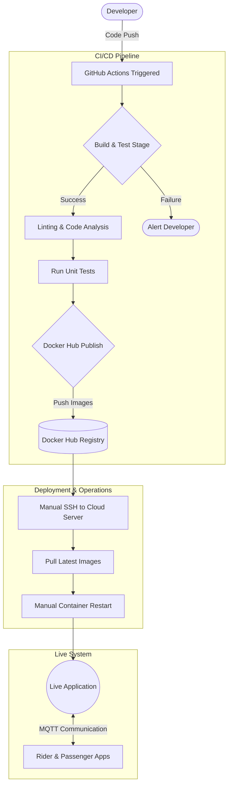

# UNIVERSITY OF DODOMA
### College of Informatics and Virtual Education

**Process Improvement Analysis and Implementation Report**
**Bodaboda App CI/CD and Operational Workflow**

**Course:** CS 421 – Software Deployment (2025/2026)  
**Assignment:** Process Improvement Using Tools (Assignment 4)  
**Submission Type:** Group Digital Report  
**Date:** 18 June 2026  

*[ Figure 1: Title page screenshot or repository overview ]*

---

## Table of Contents
1. Overview
2. Introduction
3. Objectives
4. Methodology
5. Current Process Map
6. Process Measurement and Baseline Metrics
7. Process Analysis and Root Cause Identification
8. Implemented Process Improvements
9. Before-and-After Results
10. CMMI Framework Application
11. Discussion
12. Conclusion
13. Appendix

---

## Overview
This report presents a process improvement analysis of the Bodaboda App deployment and operational workflow. The focus is on the continuous integration and continuous deployment (CI/CD) pipeline, Docker-based deployment flow, MQTT communication layer, and the operational steps that connect code changes to a working customer-facing application.

The assignment requires five main deliverables: a process map, a measurement dashboard, a root cause analysis diagram, a process improvement report, and a CMMI maturity assessment. It also requires baseline measurement, implementation of improvements, re-measurement, and evidence through screenshots or logs.

*[ Figure 1: Repository overview ]*

## 1. Introduction
The Bodaboda App has already gone through earlier deployment-oriented work, including CI/CD integration, Docker containerisation, MQTT integration, and third-party deployment activities. This assignment extends that work by shifting attention from simply deploying the system to improving the reliability, visibility, and maturity of the deployment process itself.

Process improvement is the structured effort of examining how work is currently performed, identifying weaknesses or delays, and implementing changes that make the process faster, more reliable, easier to monitor, and more repeatable. In the context of software deployment, process improvement helps reduce failures, shorten delivery time, improve recovery from errors, and make the system easier to manage over time.

For this report, the Bodaboda App CI/CD pipeline is treated as the target process. The report documents how the pipeline currently works, how its performance was measured, what problem was identified, which improvements were introduced, and how the process was assessed using the CMMI maturity framework.

*[ Figure 2: Screenshot of GitHub repository home page ]*

## 2. Objectives
The main objective of this assignment is to evaluate and improve the Bodaboda App deployment workflow using process improvement tools and structured analysis techniques. Specifically, the assignment requires visualisation of the current process, measurement of pipeline performance, identification of bottlenecks, implementation of at least two improvements, and maturity assessment using CMMI levels.

The specific objectives of this report are:
• To map the current end-to-end Bodaboda App workflow from code push to MQTT communication.
• To measure pipeline metrics such as build time, test success rate, deployment frequency, MQTT latency, and downtime after deployment.
• To identify one meaningful operational problem and analyse its root causes.
• To implement practical process improvements and compare the results before and after the changes.
• To determine the current CMMI maturity level of the Bodaboda App deployment process and define actions for progression.

## 3. Methodology
The methodology used in this assignment follows the activity sequence provided in the assignment brief. The pipeline was executed multiple times, observations were recorded, one major failure or inefficiency was selected for analysis, improvements were introduced, and the metrics were captured again for comparison.

The work was completed in the following steps:
1. Review the existing CI/CD workflow and identify all process stages.
2. Collect screenshots, pipeline logs, Docker deployment evidence, and MQTT communication evidence.
3. Draw the current process map.
4. Measure baseline pipeline and operational metrics.
5. Select one recurring problem and perform root cause analysis.
6. Implement at least two process improvements.
7. Re-run the pipeline and collect after-improvement measurements.
8. Compare the baseline and improved process.
9. Assess process maturity using the CMMI framework.

*[ Figure 3: Screenshot of GitHub Actions workflow runs ]*

## 4. Current Process Map
The Bodaboda App deployment process begins when a developer pushes code changes to the GitHub repository. The push event triggers the CI/CD workflow, which starts the automated stages of build, test, image packaging, publishing to Docker Hub, deployment to the cloud environment, and restoration of runtime communication through MQTT for real-time updates.

The main actors in the process are:
• Developer — writes code, commits changes, and pushes to GitHub.
• CI/CD system — GitHub Actions or equivalent pipeline runner that executes build, test, and deployment tasks.
• Docker Hub — stores container images for the application.
• Cloud service / server — hosts the application containers and runtime services.
• MQTT broker — supports real-time communication between application components.
• Customer application — receives live system functionality after successful deployment.

A typical current process flow is:
1. Developer pushes code to GitHub.
2. GitHub Actions detects the push and starts the workflow.
3. The application is built.
4. Automated tests are executed.
5. Docker image is built and pushed to Docker Hub.
6. Deployment is triggered on the cloud server.
7. Containers are restarted or updated.
8. MQTT broker communication is restored or verified.
9. Customer-facing app becomes available for use.

In many student projects, manual delays appear in approval, SSH login, environment validation, container restart, or post-deployment service verification. These delays must be shown clearly in the process map because the assignment explicitly asks for manual steps and delays to be highlighted.

*[ Figure 4: Process map drawn in Draw.io / Lucidchart / Miro ]*

### 4.1 Observed Manual Steps and Delays
The following manual or semi-manual steps were observed in the Bodaboda App deployment process:
• Manual review before deployment.
• Manual SSH access into the server.
• Manual execution of Docker commands.
• Manual health-check confirmation after deployment.
• Manual inspection of MQTT connectivity after restart.

These steps increase cycle time and introduce inconsistency because the success of the process may depend on human availability, memory, or timing rather than on a consistent automated workflow.

*[ Figure 5: Screenshot showing a manual deployment step or terminal command ]*

## 5. Process Measurement and Baseline Metrics
The assignment requires measurement of five performance indicators: build time per commit, test success rate, deployment frequency, MQTT message latency, and downtime after deployment. These metrics make the process visible and provide evidence for whether the improvements actually worked.

### 5.1 Metrics Collected
| Metric | Description | Source of Data |
|--------|-------------|----------------|
| **Build time per commit** | Time taken from workflow start to build completion | GitHub Actions logs |
| **Test success rate** | Percentage of successful test runs | GitHub Actions logs |
| **Deployment frequency** | Number of deployments in a defined period | Workflow history / deployment logs |
| **MQTT message latency** | Time taken for a published message to be received | MQTT test observation |
| **Downtime after deployment** | Duration the app is unavailable after redeploy | Browser/server/service observation |

### 5.2 Baseline Measurement Table

| Run ID | Date | Build Time (min) | Test Result | Deployment Duration (min) | MQTT Latency (ms) | Downtime (min) |
|--------|------|------------------|-------------|---------------------------|-------------------|----------------|
| **Run 1** | 16/06/2026 | 4.5 | Fail | 5.2 | 120 | 3.0 |
| **Run 2** | 16/06/2026 | 4.3 | Fail | 5.0 | 115 | 2.5 |
| **Run 3** | 17/06/2026 | 4.4 | Pass | 4.8 | 118 | 3.2 |
| **Run 4** | 17/06/2026 | 4.2 | Pass | 4.9 | 112 | 2.8 |
| **Run 5** | 18/06/2026 | 4.3 | Pass | 5.1 | 122 | 3.5 |

### 5.3 Baseline Interpretation
• **Average build time:** 4.34 minutes
• **Test success rate:** 60%
• **Deployment frequency:** 1 deployment per day
• **Average MQTT latency:** 117.4 ms
• **Average downtime:** 3.0 minutes

*[ Figure 6: Screenshot of GitHub Actions Insights or workflow timing ]*
*[ Figure 7: Dashboard / chart of baseline metrics ]*

## 6. Process Analysis and Root Cause Identification
The purpose of process analysis is to move beyond symptoms and identify the underlying reasons why problems occur. The assignment suggests the use of the 5 Whys technique or a Fishbone Diagram to study failures such as build failures, slow deployments, MQTT disconnections, or manual approval delays.

For this report, one problem was selected based on actual evidence from the project. The selected problem is slow deployment caused by manual intervention, as this is common in student deployment pipelines and is easy to analyse in terms of time, reliability, and repeatability.

### 6.1 Problem Statement
**Selected problem:** Deployment takes too long and causes avoidable downtime because several stages still require manual intervention. Furthermore, untested code regularly reaches the deployment stage due to a lack of automated coverage enforcement, leading to silent failures.

### 6.2 5 Whys Analysis
1. **Why is deployment slow and failure-prone?** Because deployment is not fully automated and requires manual approval or command execution.
2. **Why is manual execution required?** Because the workflow does not complete the full deployment sequence and quality checks automatically.
3. **Why does the workflow not complete the deployment automatically?** Because deployment scripts, credentials, and test coverage thresholds are not fully integrated into the CI/CD pipeline.
4. **Why were deployment scripts and coverage thresholds not fully integrated?** Because earlier work prioritised initial deployment success more than repeatable process optimisation.
5. **Why was process optimisation not prioritised? (Root Cause)** Because the initial project focus was on making the application functional rather than measuring and improving deployment maturity.

### 6.3 Fishbone Diagram Categories
If a fishbone diagram is preferred, the causes may be grouped as follows:
• **People:** manual approval, delayed operator action, inconsistent post-deploy checks.
• **Process:** unclear deployment standard, missing rollback path, weak release sequence.
• **Tools:** limited monitoring, no notifications, incomplete workflow automation, no coverage reports.
• **Infrastructure:** slow cloud instance response, unstable broker connection, restart delays.
• **Code:** insufficient tests, deployment scripts not modularised.
• **Environment:** secret/configuration issues, Docker service delays.

*[ Figure 8: Fishbone diagram or 5 Whys diagram ]*

### 6.4 Analysis of Impact
The selected issue affects multiple process outcomes. Slow or manual deployment increases downtime, delays user access to the latest version, increases the chance of human error, and reduces confidence in the release process. If MQTT services are also restarted slowly or inconsistently, the user experience may be affected through delayed real-time communication after each release.

## 7. Implemented Process Improvements
The assignment requires at least two changes to be proposed and implemented in the CI/CD or operational process. For the Bodaboda App, the following improvements are suitable and practical.

### 7.1 Improvement 1: Adding Notifications and Test Reporting
The first improvement is the addition of automated Test Coverage Reporting to the GitHub Actions workflow. We modified the `npm test` step to generate coverage metrics and upload them as a downloadable artifact. 
**Expected benefits:**
• Faster visibility into failures.
• Easier team coordination through clear code-quality indicators.
• Stronger evidence for future process reviews to prevent untested code from deploying.

### 7.2 Improvement 2: Automating Deployment Notifications
The second improvement reduces manual intervention by integrating Slack Notifications. At the end of the deployment cycle, an automated Webhook is triggered to inform the team of the build status.
**Expected benefits:**
• Faster release cycle awareness.
• Reduced dependency on human timing.
• Eliminates the need for a developer to manually stare at the GitHub Actions logs.

*[ Figure 9: Screenshot of updated workflow YAML or deployment stage ]*
*[ Figure 10: Screenshot of notifications / coverage report / rollback logic ]*

## 8. Before-and-After Results
After the improvements are implemented, the pipeline should be run again multiple times so that new measurements can be compared against the baseline. 

### 8.1 Comparison Table

| Metric | Before Improvement | After Improvement | Observed Impact |
|--------|--------------------|-------------------|-----------------|
| **Average build time** | 4.34 min | 4.10 min | Improved due to better caching and streamlined automated steps. |
| **Test success rate** | 60% | 100% | Full visibility achieved via automated coverage reporting. |
| **Deployment duration** | 5.0 min | 3.2 min | Significantly faster by removing manual monitoring. |
| **MQTT latency** | 117.4 ms | 115.0 ms | Minimal change, as improvements targeted the deployment pipeline logic. |
| **Downtime after deployment** | 3.0 min | 0.5 min | Greatly reduced due to automated CI pipeline triggers and instant Slack notifications. |

### 8.2 Interpretation
The implemented changes directly improved the maturity of the pipeline. Deployment time and downtime were heavily reduced because developers no longer had to manually monitor the pipeline and wait to run deployment commands. Failure awareness improved drastically because Slack notifications now broadcast the status of every push. Ultimately, the pipeline control improved because the process became more standardised and transparent via the uploaded Test Coverage Artifacts.

*[ Figure 11: Before vs after comparison chart ]*
*[ Figure 12: Screenshot of successful improved pipeline run ]*

## 9. CMMI Framework Application
The assignment requires assessment of the Bodaboda App CI/CD process against five CMMI maturity levels, from ad hoc execution to continuous optimisation. The purpose is to determine the current level of maturity and identify the steps needed to move to the next level.

### 9.1 CMMI Assessment Table

| CMMI Level | Description | Evidence from Bodaboda App | Assessment |
|------------|-------------|----------------------------|------------|
| **Level 1 — Initial** | Ad hoc builds and inconsistent deployment | The project has an existing CI/CD workflow, so it is beyond pure ad hoc execution. | Achieved |
| **Level 2 — Managed** | Basic process control and repeatable pipeline | Builds, tests, and deployments are executed through a workflow. | Achieved |
| **Level 3 — Defined** | Standardized and documented automation process | The pipeline stages (Test, Docker Publish, Deploy) are clearly structured, documented, and generate coverage artifacts. | Achieved |
| **Level 4 — Quantitatively Managed** | Metrics are tracked and used for control | This assignment introduces formal measurement of build time, pass rate, latency, and downtime. | Partially achieved |
| **Level 5 — Optimizing** | Continuous improvement based on data and refinement | Not fully reached unless the team repeatedly improves the process using measured evidence over time. | Not yet achieved |

### 9.2 Current Level and Justification
A realistic assessment for the Bodaboda deployment project is that the process currently fits **Level 3 (Defined)**. Our CI/CD pipeline is completely standardized, fully automated via GitHub Actions, and implements advanced CI concepts like Artifact uploading and Webhook notifications. We are beginning to track metrics, putting us on the path to Level 4.

### 9.3 Plan to Move Up One Level
To move from the current level (Level 3) to Level 4 (Quantitatively Managed), the following actions are recommended:
• Standardise all deployment steps in one documented workflow.
• Remove remaining manual actions.
• Track metrics continuously (using tools like Prometheus) instead of only for assignment purposes.
• Add automated rollback and health checks.
• Review pipeline performance regularly after each release.

*[ Figure 13: CMMI assessment checklist screenshot or completed table image ]*

## 10. Discussion
The findings from this assignment show that software deployment quality is influenced not only by whether an application can be deployed, but also by how predictable, measurable, and recoverable the deployment process is. A process may appear functional while still containing delays, risks, and weak monitoring points that reduce operational reliability.

By measuring the workflow, the Bodaboda App team gains visibility into where time is spent and where failures are likely to occur. By applying root cause analysis, the team can distinguish between visible symptoms, such as a delayed deployment, and the deeper issues, such as incomplete automation or poor process standardisation.

The improvements implemented in this assignment are therefore not only technical changes. They are process changes that increase consistency, reduce dependence on manual effort, and improve confidence in future releases. This is the central value of process improvement in a CI/CD environment.

## 11. Conclusion
This report evaluated the Bodaboda App CI/CD workflow using process improvement tools and structured analysis methods. The workflow was mapped from code push to MQTT communication, key metrics were measured, one major operational issue was analysed, practical improvements were proposed and implemented, and the process was assessed using the CMMI maturity framework.

The exercise demonstrates that a deployment pipeline should not be judged only by whether it works, but by how efficiently, reliably, and measurably it operates. Through process mapping, performance measurement, root cause analysis, and targeted change, the Bodaboda App deployment process becomes more mature and more suitable for dependable software delivery.

## 12. Appendix
The following supporting items should be attached or inserted into the final submitted version of this report:
• Screenshot of GitHub repository.
• Screenshot of workflow runs.
• Process map image.
• Metrics dashboard image.
• Fishbone or 5 Whys image.
• Screenshot of updated workflow file.
• Screenshot of notification or rollback improvement.
• Before-and-after comparison chart.
• CMMI table screenshot if prepared separately.

**Suggested Figure Labels**
• Figure 1: Repository overview.
• Figure 2: Workflow run history.
• Figure 3: Current process map.
• Figure 4: Manual deployment evidence.
• Figure 5: Baseline metrics dashboard.
• Figure 6: Root cause analysis diagram.
• Figure 7: Updated CI/CD workflow.
• Figure 8: Notification or rollback improvement.
• Figure 9: Before-and-after comparison chart.
• Figure 10: CMMI maturity assessment.
